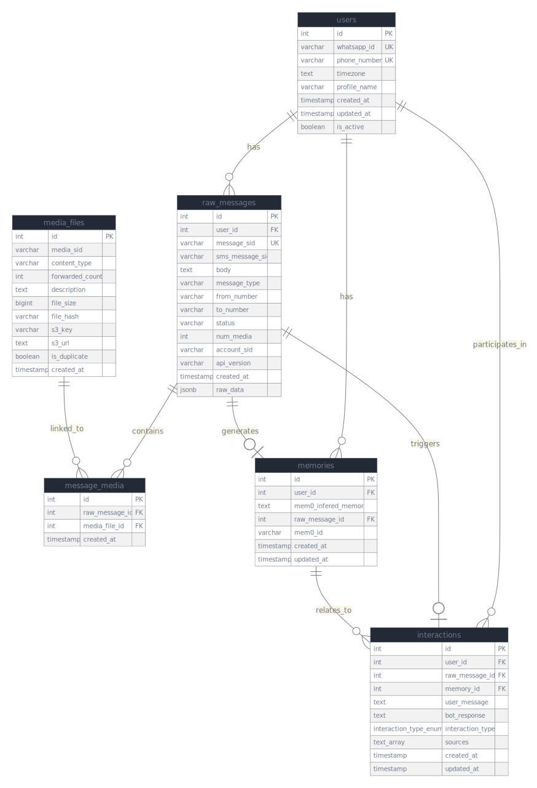

# Whatsy! - WhatsAPP AI Memory Assistant made with Mem0

## Tech Stack Overview

* **Backend & API**: FastAPI, Uvicorn, Pydantic
* **Database & Storage**: PostgreSQL, Redis (cache & queue), S3-compatible storage
* **AI/ML**: Mem0 (memory engine), Google Gemini AI (NLP), PyTZ (timezone)
* **Messaging**: Twilio WhatsApp API & SDK
* **Async Processing**: Celery with Redis broker
* **Utilities**: Hashlib (SHA-256 deduplication), Asyncio, Python-dotenv
* **Language**: Python 3.x


## Installation and Setup

1. Install Python dependencies:
```bash
pip install -r requirements.txt
```

2. Set up your `.env` file with all the required configuration keys listed above

3. Run database migrations:
```bash
# Execute the SQL files in migrations/ folder in order
```

4. Start the Celery worker (for asynchronous processing):
```bash
python scripts/start_worker.py
```

5. Run the main application:
```bash
uvicorn main:app --reload --port 8000
```

## Required Configuration Keys and Instruments

This project requires several external services and API keys to function properly. Create a `.env` file in the project root with the following environment variables:

### Database Configuration (PostgreSQL)
```env
POSTGRES_DB=your_database_name
POSTGRES_USER=your_username
POSTGRES_PASSWORD=your_password
POSTGRES_URL=your_postgres_host
POSTGRES_PORT=5432
```

### Object Storage (S3-Compatible)
For storing media files (images, audio, documents) from WhatsApp messages:
```env
BUCKET_URL=your_s3_endpoint_url
BUCKET_NAME=your_bucket_name
BUCKET_ACCESS_KEY=your_access_key
BUCKET_SECRET_KEY=your_secret_key
```

### Twilio WhatsApp API
For WhatsApp messaging integration:
```env
TWILIO_ACCOUNT_SID=your_twilio_account_sid
TWILIO_AUTH_TOKEN=your_twilio_auth_token
TWILIO_PHONE_NUMBER=yout_twilio_given_phno
```

### Mem0 AI Service
For AI memory management:
```env
MEM0_API_KEY=your_mem0_api_key
```

### Google Cloud (Gemini AI)
For AI processing capabilities:
```env
GOOGLE_APPLICATION_CREDENTIALS=path_to_your_service_account_json_file
```

### Redis (for Celery Task Queue)
For asynchronous message processing:
```env
REDIS_HOST=your_redis_host
REDIS_PORT=6379
REDIS_DB=0
REDIS_PASSWORD=your_redis_password
```

## Required External Services

### 1. PostgreSQL Database
- Install and configure a PostgreSQL instance
- Run the migration scripts in the `migrations/` folder to set up the database schema
- Ensure the database is accessible from your application

### 2. Redis Server
- Required for Celery task queue management
- Install Redis server or use a cloud Redis service
- Used for asynchronous processing of WhatsApp messages

### 3. S3-Compatible Object Storage
- For storing media files from WhatsApp messages
- Can use AWS S3, MinIO, or any S3-compatible storage service
- Ensure proper read/write permissions are configured

### 4. Twilio Account
- Sign up for Twilio account
- Configure WhatsApp Business API sandbox or production account
- Set up webhook URL pointing to your `/webhook` endpoint

### 5. Mem0 AI Service
- Sign up for Mem0 AI service
- Obtain API key for memory management functionality

### 6. Google Cloud Platform
- Create a GCP project
- Enable Gemini AI API
- Create a service account and download the JSON credentials file
- Set the path to this file in `GOOGLE_APPLICATION_CREDENTIALS`

## Database Schema

The application uses a PostgreSQL database with the following structure:



The database schema includes tables for:
- **users**: Store WhatsApp user information
- **raw_messages**: Store incoming WhatsApp messages
- **media**: Store media file metadata
- **memories**: Store AI-generated memories
- **interactions**: Track user interactions

For detailed schema definitions, see the migration files in the `migrations/` folder.


The application will start on `http://localhost:8000` and be ready to receive WhatsApp webhooks at `/webhook`.

Swagger docs and API endpoints can be accessed at `http://localhost:8000/docs`

# Notes
## 1. Media Deduplication

* Each media file gets a SHA-256 hash.
* Before saving, the system checks if the hash already exists.
* If duplicate: reuse the record, increment a forward/share counter, and link it to the new message without re-uploading.
* Only unique files go to S3, saving storage and bandwidth.
* Tracks how many times a file is reused.

## 2. Timezone Handling

* User’s timezone is inferred at registration (fallback: UTC).
* All timestamps are stored in UTC.
* When users ask time-based queries (“today”, “last week”), the system:

* Detects date ranges, converts them to UTC with `pytz`.
* Adjusts end dates to be exclusive for accurate filtering.
* Applies these filters to memory search.

## 3. Twilio Ingestion Idempotency
* Each Twilio message is keyed by its unique `MessageSid`.
* Before processing, the system checks if the SID already exists.
* If duplicate: logs it, returns the existing bot response, and skips reprocessing (including media and AI calls).
* Ensures database consistency, reduces API cost, and keeps user responses consistent.


